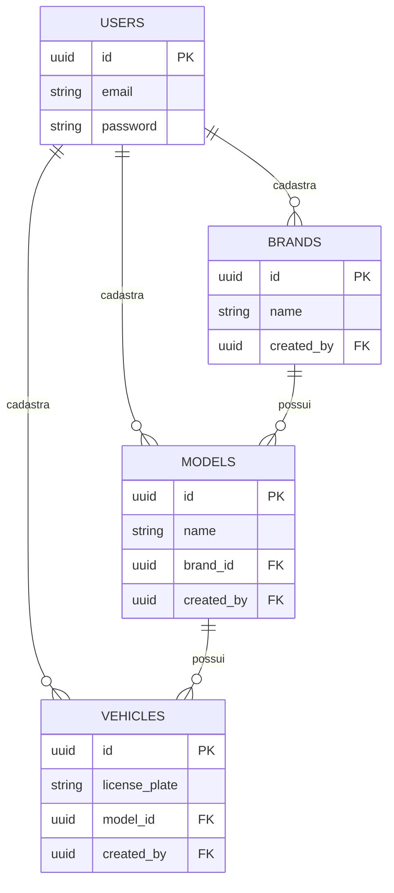

# 🚗 Fleet Management API

[](https://nestjs.com/)
[](https://www.typescriptlang.org/)
[](https://www.docker.com/)
[](https://www.microsoft.com/sql-server)
[](https://redis.io/)

Uma API robusta e escalável para gerenciamento de frotas de veículos, desenvolvida com **NestJS**, **SQL Server** e **Redis**. O sistema oferece controle completo sobre marcas, modelos e veículos, com autenticação JWT e auditoria automática de registros.

---

## 🚀 Tecnologias Utilizadas

-   **Framework:** [NestJS](https://nestjs.com/) (Node.js)
-   **Linguagem:** [TypeScript](https://www.typescriptlang.org/)
-   **Banco de Dados:** [Microsoft SQL Server](https://www.microsoft.com/sql-server)
-   **ORM:** [TypeORM](https://typeorm.io/)
-   **Cache:** [Redis](https://redis.io/)
-   **Autenticação:** [Passport-JWT](https://www.passportjs.org/packages/passport-jwt/)
-   **Containerização:** [Docker](https://www.docker.com/) & [Docker Compose](https://docs.docker.com/compose/)
-   **Testes:** [Jest](https://jestjs.io/) & [Supertest](https://github.com/visionmedia/supertest)

---

## 🛠️ Requisitos e Instalação

### Pré-requisitos
-   [Node.js](https://nodejs.org/) (v18 ou superior)
-   [Docker Desktop](https://www.docker.com/products/docker-desktop/)
-   [Git](https://git-scm.com/)

### Passo a Passo

1.  **Clonar o Repositório:**
    ```bash
    git clone https://github.com/KarlZacferro/fleet-management-api.git
    cd fleet-management-api
    ```

2.  **Instalar Dependências:**
    ```bash
    npm install
    ```

3.  **Configurar Variáveis de Ambiente:**
    Crie um arquivo `.env` na raiz do projeto baseado no `.env.example`:
    ```env
    DB_HOST=localhost
    DB_PORT=1434
    DB_USERNAME=sa
    DB_PASSWORD=SuaSenhaForte123
    DB_DATABASE=fleet_db

    REDIS_HOST=localhost
    REDIS_PORT=6379
    REDIS_TTL=3600

    JWT_SECRET=sua_chave_secreta_aqui
    ```

4.  **Subir os Serviços (Docker):**
    ```bash
    docker-compose up -d
    ```
    *Este comando iniciará o SQL Server e o Redis em containers.*

5.  **Executar a Aplicação:**
    ```bash
    # Modo Desenvolvimento
    npm run start:dev

    # Modo Produção
    npm run build
    npm run start:prod
    ```

---

## 🏗️ Arquitetura e Lógica

A aplicação segue os princípios de **Clean Architecture** e **SOLID**, organizada de forma modular:

-   **Módulos:** Cada entidade possui seu próprio contexto isolado (Users, Brands, Models, Vehicles).
-   **Auditoria Automática:** Todas as tabelas possuem os campos `created_at`, `updated_at` e `created_by`. O sistema extrai o ID do usuário do token JWT para preencher o `created_by` automaticamente.
-   **Estratégia de Cache (Cache Aside):**
    -   A listagem de veículos é armazenada no Redis para alta performance.
    -   O cache é invalidado (`DEL`) sempre que um veículo é criado, editado ou removido.
-   **Resiliência:** A aplicação possui mecanismos de *fallback* para o Redis. Se o servidor de cache estiver offline, a API continua operando normalmente consultando o banco de dados diretamente.

---

## 📊 Estrutura de Dados

### Relacionamentos (Diagrama ER)



### Regras de Negócio
-   **Hierarquia:** Um Veículo obrigatoriamente pertence a um Modelo, que por sua vez pertence a uma Marca.
-   **Segurança:** Todas as rotas (exceto Login e Cadastro de Usuário) exigem autenticação via Bearer Token.

---

## 🧪 Testes

O projeto utiliza **Jest** para garantir a qualidade do código.

```bash
# Executar todos os testes
npm run test

# Executar testes E2E (End-to-End)
npm run test:e2e

# Verificar cobertura de testes
npm run test:cov
```

---

## 📡 Endpoints Principais

A API está documentada e utiliza o prefixo `/api/v1`.

| Método | Rota | Descrição |
| :--- | :--- | :--- |
| `POST` | `/auth/login` | Autenticação e geração de Token |
| `POST` | `/users` | Cadastro de novo administrador |
| `GET` | `/vehicles` | Listagem de frota (com Cache Redis) |
| `POST` | `/brands` | Cadastro de fabricante |
| `POST` | `/models` | Cadastro de modelo vinculado a marca |

---

## 📄 Licença
Este projeto está sob a licença MIT. Veja o arquivo [LICENSE](LICENSE) para mais detalhes.

---
*Desenvolvido para demonstração técnica de competências em Backend Engineering.*
