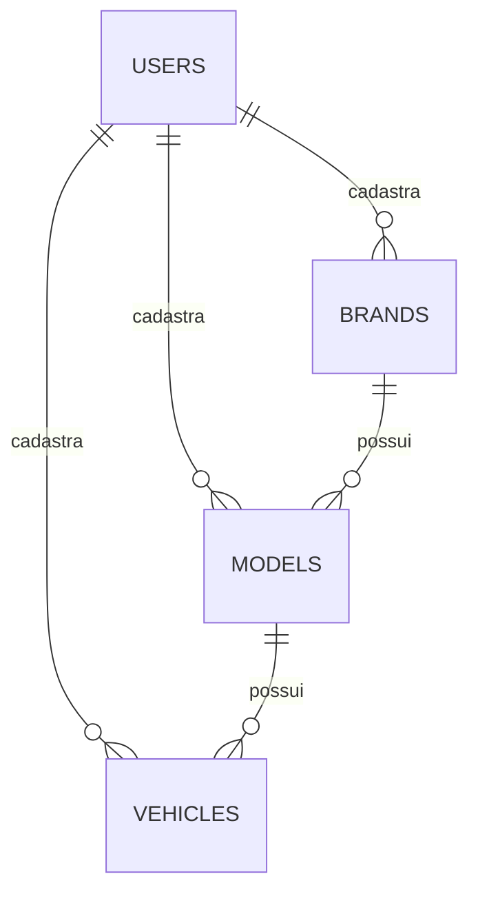

# 🚗 Fleet Management API

[](https://nestjs.com/)
[](https://www.typescriptlang.org/)
[](https://www.docker.com/)
[](https://www.microsoft.com/sql-server)
[](https://www.mongodb.com/)
[](https://redis.io/)

Uma API robusta e escalável para gerenciamento de frotas de veículos, desenvolvida com **NestJS**, utilizando uma arquitetura de banco de dados híbrida (**SQL Server** para dados relacionais e **MongoDB** para auditoria) e **Redis** para cache de alta performance.

---

## 🚀 Tecnologias Utilizadas

-   **Framework:** [NestJS](https://nestjs.com/) (Node.js v18+)
-   **Linguagem:** [TypeScript](https://www.typescriptlang.org/)
-   **Banco de Dados Relacional:** [Microsoft SQL Server](https://www.microsoft.com/sql-server) (Gestão de Frota)
-   **Banco de Dados NoSQL:** [MongoDB](https://www.mongodb.com/) (Logs de Auditoria)
-   **ORM/ODM:** [TypeORM](https://typeorm.io/) & [Mongoose](https://mongoosejs.com/)
-   **Cache:** [Redis](https://redis.io/) (Obrigatório para consultas de veículos)
-   **Autenticação:** [Passport-JWT](https://www.passportjs.org/packages/passport-jwt/)
-   **Containerização:** [Docker](https://www.docker.com/) & [Docker Compose](https://docs.docker.com/compose/)
-   **Testes:** [Jest](https://jestjs.io/) (Cobertura de Regras de Negócio e Serviços)

---

## 🏗️ Arquitetura e Diferenciais Técnicos

A aplicação foi desenhada seguindo os requisito focando em escalabilidade, segurança e observabilidade.

### 1. Persistência Híbrida de Dados
-   **SQL Server (Relacional):** Utilizado para o núcleo do negócio (Marcas, Modelos e Veículos). Garante integridade referencial e consistência através do TypeORM.
-   **MongoDB (NoSQL):** Implementado como sistema de **Auditoria**. Todas as interações críticas com o banco de dados (Criação, Atualização e Remoção) são registradas de forma assíncrona no MongoDB, permitindo um rastro histórico completo sem onerar a performance do banco principal.

### 2. Estratégia de Cache com Redis
-   **Performance:** A listagem de veículos (`GET /vehicles`) utiliza o padrão **Cache Aside**. Os dados são servidos pelo Redis com expiração configurável.
-   **Consistência:** O cache é automaticamente invalidado em qualquer operação de escrita (`POST`, `PATCH`, `DELETE`) em veículos, garantindo que o usuário nunca visualize dados obsoletos.

### 3. Segurança e Auditoria
-   **JWT:** Proteção de rotas com autenticação Bearer Token.
-   **Metadados:** Todas as entidades SQL possuem rastreabilidade (`created_at`, `updated_at`, `created_by`).
-   **Logs de Auditoria:** Interceptor global que captura metadados das requisições e salva o histórico de mudanças no MongoDB.

---

## 🛠️ Instalação e Execução

### Pré-requisitos
-   [Docker Desktop](https://www.docker.com/products/docker-desktop/)
-   [Node.js v18+](https://nodejs.org/)

### Passo a Passo

1.  **Clonar e Instalar:**
    ```bash
    git clone https://github.com/KarlZacferro/fleet-management-api.git
    cd fleet-management-api
    npm install
    ```

2.  **Configurar Ambiente:**
    Crie um arquivo `.env` baseado no `.env.example`. Certifique-se de configurar as strings de conexão para SQL Server, MongoDB e Redis.

3.  **Subir Infraestrutura:**
    ```bash
    docker-compose up -d
    ```
    *Isso iniciará o SQL Server, MongoDB e Redis prontos para uso.*

4.  **Executar API:**
    ```bash
    npm run start:dev
    ```

---

## 🧪 Qualidade de Código e Testes

O projeto mantém uma rigorosa cobertura de testes utilizando **Jest**. Foram implementados testes unitários e de integração para serviços e regras de negócio.

```bash
# Executar testes unitários
npm run test

# Verificar cobertura de código (Coverage)
npm run test:cov
```

---

## 📡 Endpoints e Modelagem

A API segue o padrão RESTful com prefixo `/api/v1`.

| Método | Rota | Descrição |
| :--- | :--- | :--- |
| `POST` | `/auth/login` | Autenticação e geração de Token |
| `POST` | `/users` | Cadastro de novo administrador |
| `GET` | `/vehicles` | Listagem de frota (com Cache Redis) |
| `POST` | `/brands` | Cadastro de fabricante |
| `POST` | `/models` | Cadastro de modelo vinculado a marca |

## 📊 Estrutura de Dados

### Relacionamentos (Diagrama ER)



### Regras de Negócio
-   **Hierarquia:** Um Veículo obrigatoriamente pertence a um Modelo, que por sua vez pertence a uma Marca.
-   **Segurança:** Todas as rotas (exceto Login e Cadastro de Usuário) exigem autenticação via Bearer Token.

### Entidades Principais:
-   **Brands (Marcas):** Fabricantes dos veículos.
-   **Models (Modelos):** Modelos vinculados a uma marca específica.
-   **Vehicles (Veículos):** Unidades da frota com placa, chassi e renavam.
-   **Audit (Auditoria):** Registros históricos armazenados no MongoDB.

---

## 📄 Critérios de Avaliação Atendidos
-   ✅ **Arquitetura Limpa:** Separação clara de responsabilidades e módulos.
-   ✅ **Segurança:** Autenticação JWT e proteção de rotas.
-   ✅ **Performance:** Cache Redis obrigatório nas consultas.
-   ✅ **Auditoria:** Registro de logs em banco NoSQL (MongoDB).
-   ✅ **Testes:** Cobertura de serviços e validações de negócio.

---
*Desenvolvido para demonstração técnica de competências em Backend Engineering.*

